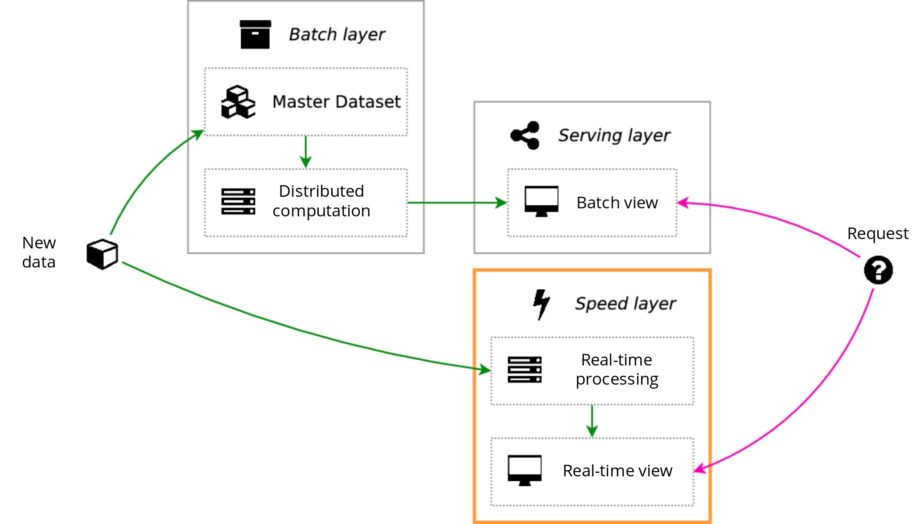

# Design Big Data architectures

## What is a good architecture?

* **Fault tolerance**
* **Good maintainability**
* **Low cost**

 

## The need for Lambda Architectures

Imagine you're in charge of an application, and you want to monitor its popularity by measuring the number of visits on each page, and listing the top 100 pages in terms of visits.

If your website uses a MySQL database, a natural solution would be a `visit` table with `url` and `count` fields, that the webapp increments everytime a page is visited (using a simple SQL `UPDATE`). This works only while you don't have too much visits; **SQL databases are not optimized for a huge number of concurrent writes**, and the incrementation will start taking too long pretty quickly.

To overcome this issue, you identify 2 solutions:
* Creating a file of events that will be then procesed by batch and in parallel by workers. This is a nice workaround, bu the conclusion remains the same: writing to a SQL database is a hard bottleneck.
* **Sharding**, i.e. splitting the lines of the `visit` table among different servers (a *shard* is a part of the table). This makes the administration of the database dramatically more complex, even for simple tasks like adding a shard.

 

You therefore decide to switch to a **NoSQL** solution (e.g. MongoDB), that **natively supports sharding and guarantees the consistency of your data**. This implements both of the workarounds you found (sharding, and the file of events processed by workers in parallel), and **naturally scales** by simply adding shards and workers. Everyone's happy.

However, one day a developer makes a mistake, and some workers start incrementing by 2 instead of 1. You fix this bug as fast as you can, but in the meantime your statistics get heavily biased and, since you did not track of the operations, you have no way of correcting the data. You take some time to think, and come to realize that you need your stats to be **re-computable at every step**, which means you have to **store the entire log of all visits**.

 

Luckily, the notion of **Lambda Architecture** comes in handy for this type of problems (and many others). The design of this architecture follows three main constraints:
* **Scaling** horizontally, i.e. simply by adding servers while ensuring robustness and fault tolerance
* **Ease of maintenance**
* **Ease of data exploitation**

From these constraints, the lambda architecture was designed based on three layers: *batch layer*, *speed layer* and *serving layer*.

  

## The Batch Layer: data batch processing

This layer has two main (crucial) responsibilities:
* **Storage** of the data (e.g. HDFS)
* **Computation** on the data (MapReduce, e.g. Hadoop/Spark)

The storage part is managed by the **Master Dataset**, which will be contained in a **data lake** and, typically, physically implemented using a **distributed file system** like HDFS to ensure low-cost horizontal scaling and fast write/read operations.

The master dataset will be considered as a **source of truth**, and thus the data it contains will never be modified or deleted. This means that, instead of storing the last value for a given data point, it will **store the entire history of modifications** of this data point. The data will be stored in a **normalized** fashion, along with their scheme in a specific serialization format.

The batch processing part is based on the **MapReduce** framework, typically using solutions like **Hadoop** or **Spark**, that manage fault tolerance without human intervention.

 

## The Serving Layer: sharing data

This layer is in charge of **storing and serving to users the results** of batch processing computations made in the Batch Layer. It acts like a simple database that must respect two constraints (in addition to horizontal scaling and fault tolerance):
* **Batch write** since the Batch Layer will send results by batch
* **Random read** since users will want to access whatever specific data point. This requires building indexes to speed up access.

Most **NoSQL** solutions satisfying these two constraints are good candidates, e.g. MongoDB, ElasticSearch, Cassandra. Among the bad candidates, SQL databases do not scale horizontally, and key-value databases generally do not allow indexes.

 

# The Speed Layer: keeping up to date

Sometimes users need to access the most recent data, before it is even added to the serving layer. The role of the Speed Layer will thus be **to aggregate the most recent data and share a view for users to make requests to**. As soon as the data is inserted into the Serving Layer, we can delete it from the Speed Layer.

Since data errors are not so impactful here, some constraints are relaxed, and notably data is stored in a **denormalized** fashion. Moreover, we can store in this layer aggregated data instead of raw data (for space and speed), much like our initial SQL try. Unfortunately, **real-time data processing** that is both horizontally scaling and fault tolerant is not so easy to develop; fortunately, tools like Storm were developped precisely to answer this issue.

Real-time data processing will frequently update the Speed Layer's view, which will thus be subject to two constraints:
* **Random write**
* **Random read**

Once again, NoSQL solutions like MongoDB, ElasticSearch and Cassandra will be good candidates for the Speed Layer.

A tough issue regarding the Speed Layer is the expiration of data (when inserted into the Serving Layer) when storing aggregated data. There is no elegant solution to this problem, but a convenient one is storing at all time *two views*, one current and one future, that periodically switch and get reset.