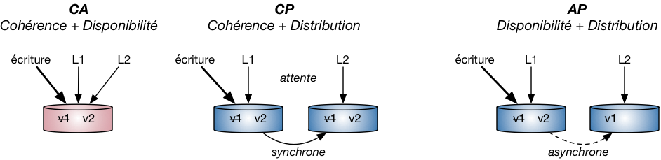

# Master NoSQL databases

## Master the CAP theorem

### Fundamental properties of relational databases

Relational databases have at least 3 fundamental properties that make them worthy choices. They allow:
1. Making joins between tables
2. Performing complex requests using a high-level query language, without caring about lower layers
3. Guaranteeing the consistency of data at every time step

The consistency point is especially interesting in the context of NoSQL databases, which often make different choices.

 

### ACID vs BASE

In relational databases, transactions follow the **ACID properties**:
* **Atomicity** - a transaction is performed entirely, or not at all
* **Consistency** - the database content must be consistent at the beginning and the end of a transaction
* **Isolation** - a transaction's modifications are only effective when it's been validated
* **Durability** - once a transaction has been committed, it will remain committed even in the case of a system failure

In a distributed context such as NoSQL's, such constraints cannot hold (e.g. for latency considerations). Hence NoSQL databases follow the **BASE properties**:
* **Basically Available** - whatever the load, the system guarantees a data availability rate
* **Soft-state** - the base can change during updates or server addition/removal; it does not have to be consistent at every time step
* **Eventually consistent** - in the long run, the database will reach a consistent state

 

### The CAP theorem

The **CAP theorem** states that under some specific but mild assumptions, database systems can respect **at most 2 of the 3 following properties**:
1. **Consistency** - a data point has a single visible state whatever the number of replicates
2. **Availability** - as long as the system runs, the data is available
3. **Partition tolerance** - whatever the number of servers, any request must return a correct result

**[WARNING: The CAP theorem does not always apply, but it gives an interesting analysis grid. Keep a critical mind.]**

This yields three possible behaviors for a wide range of databases:
* **CA** (Consistency-Availability), only available in relational databases (no delay in the context of concurrent operations)
* **CP** (Consistency-Partition tolerance), which means distribution over partitions and a system of synchronization, creating delay for the user (e.g. MongoDB)
* **AP** (Availability-Partition tolerance), with distribution over partitions and asynchronous updates, meaning *eventual consistency* but giving low response times (e.g. Cassandra)

Such a classification can be summed up in the **CAP triangle**

