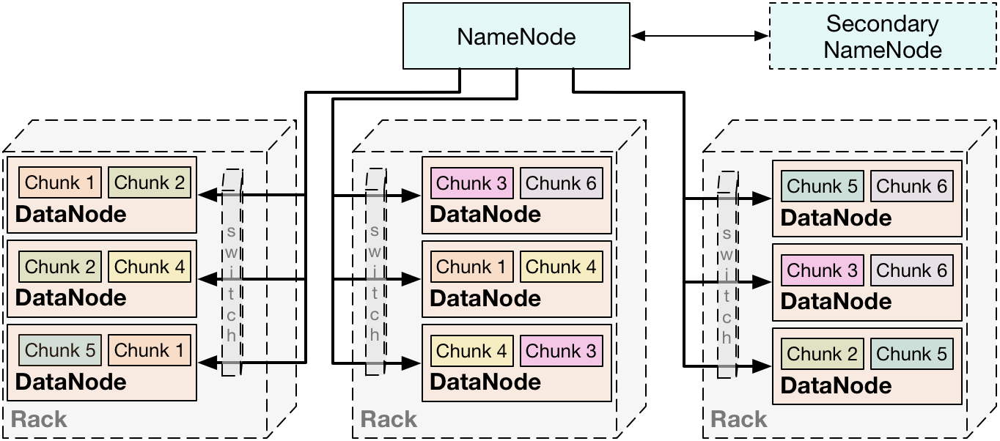
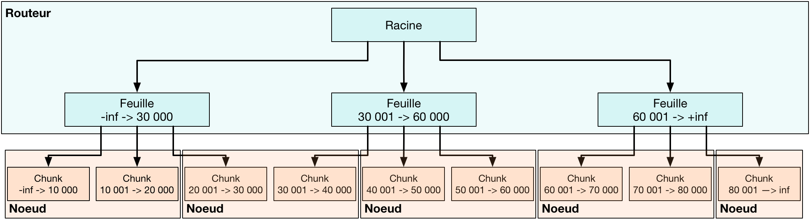
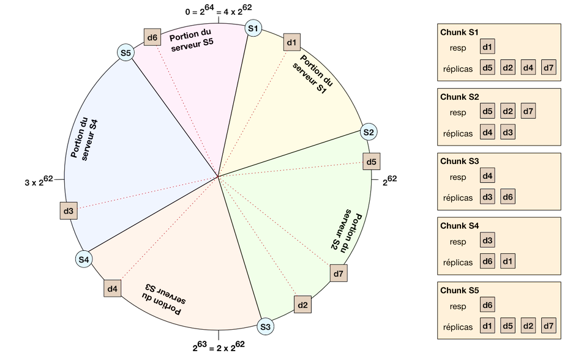

# Master NoSQL databases

## Scale using sharding

### The origins of data distribution and sharding

A lot of NoSQL solutions use a **clustered index** (implemented as a BTree), where the data is stored in a sorted fashion.

**Elasticity** is the ability of the system to automatically adapt the data distribution to the number of available servers (for better load management).

**Sharding** is a technique that distributes *chunks* of files on a cluster, with the ability to manage elasticity and fault tolerance. Three wide sharding families are available in the NoSQL family: *HDFS, clustered index, consistent hashing*.

 

### HDFS (Hadoop Distributed File System)

* Each file is split into 64MB chunks, that will be distributed over *datanodes* (servers) according to a repartition defined to a central *namenode*
* Each chunk is **replicated** on a number of distinct servers, for fault tolerance
* The namenode itself is replicated into a *secondary namenode*
* No processing happens on the namenode; it is only responsible of the data distribution according to the physical structure of the cluster, which makes it **rack-aware**
* This system naturally supports elasticity, yields a great computational power and a good fault tolerance (defined by the replication factor)
* A lot of NoSQL solutions are based on HDFS, most notably column-oriented ones like *HBase, PigLatin, Spark*

 

### Clustered index

* A central server acts as a **router** and manages the tree, while the data is stored on the nodes of the cluster
* The router (**replicated** for fault tolerance) handles the requests, and grants the elasticity by modifying the range of each node
* The **nodes themselves maintain the data replication**
* This system allows good aggregate computations (on the sorted data), and facilitates the data consistency management by delegating data replication and synchronisation to the nodes themselves

 

### Consistent Hashing and DHT (Distributed Hash Table)

* **Consistent Hashing** - Both the data and the hash table are distributed. Each data point is projected to a point on the circle (using the hash function). Each machine is also projected to a point on the circle (not at random, but to balance the load), and manages the data located on the portion of circle that stands between itself and the next machine (trigonometric ordering).
* Elasticity is very natural in this system
* Each data point is **replicated** on three contiguous servers (previous ones)
* Data requests are handled via **dichotomy search** in a way that is very specific to the circular disposition of the servers, but that guarantees reasonable response times
* This system is totally distributed with a **self-management** ability, and elasticity is simple (even though heavy load zones are hard to identify)
* However, fault tolerance is harder, and the data is not sorted like it is using a clustered index