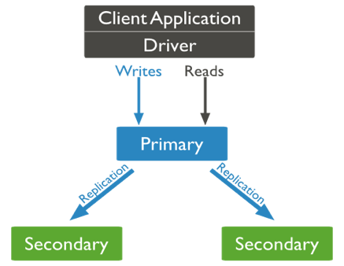

# Master NoSQL databases

## Fault tolerance using ReplicaSets

### The ReplicaSet architecture

For fault tolerance, MongoDB uses a master/slave architecture called **ReplicaSet**. All requests are sent to a **Primary** server, which manages data consistency by triggering a replication on **Secondary** servers during updates.

As such, the Primary is still a critical point. An **arbiter** is therefore added to the system; whenever the Primary falls down, a **vote** happens, and the arbiter designates the new Primary among Secondary servers. Thus, for fault tolerance, a ReplicaSet must at least be distributed over 3 servers (1 Primary, 2 Secondary).

 

### The oPlog file

How are data replicated? A specific collection, the **oPlog file**, is defined on the Primary and stores all update operations. Secondary servers simply read this collection and apply the updates on their images. This file has a **capped size** though (*capped collection*), and increasing the cap may be necessary for some applications.

**By default, replication is asynchronous**; but as long as the data is only available from the Primary server, this doesn't affect consistency.

 

### High availability

By default, all reading requests are performed on the Primary, which eventually causes heavy loads. To balance the load, it is possible to route those requests, using a predefined behavior:
- **Primary** - default value, all requests are performed on the Primary
- **PrimaryPreferred** - route to Secondary servers when the Primary is unavailable
- **Secondary** - route to Secondary servers only (writing requests still sent to Primary) - no consistency guarantee
- **Nearest** - route to the physically closest server - no consistency guarantee
