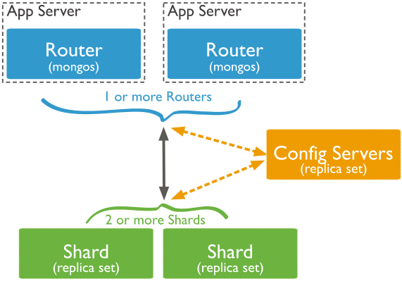

# Master NoSQL databases

## Distribute your data with MongoDB

### The sharding architecture in MongoDB

MongoDB's cluster's robustness is driven by 3 types of nodes:
* **Mongos** (at least 2) - they are *routers* that store the info on the BTree used as a clustered index
* **ConfigServers** (at least 3, organized in ReplicaSets) - they manage the knowledge of the network, e.g. load balancing info, ReplicaSets structures, BTree info for synchronization
* **Shards** (at least 2) - these are the data servers, storing *chunks*

 

### Distribution strategy

#### Request by intervals

By default, the data is distributed according to a sorting on the `_id` field (remember that a clustered index means that the data is physically sorted). This means that **requests by intervals are optimized**; it is important to wisely choose the sorting key, because we rarely care about requests optimized for `_id` intervals.

When considering for example a database of restaurants, a first idea would be to use the *zipcode* as a **sharding key**, i.e. the key alogn which the data is sorted.

#### Request by zones

However, we would like to fully control the physical repartition of the shards (e.g. to group by geographical zones, to reduce latency for all regions using dedicated/nearby servers). This can be done using **sharding by zone**, where we define a *tag* and a *range* that will constitute the *zone*. Be careful however not to imbalance shards too much, nor to overload any.

#### Request by categories

If we want to shard using a categorical key (e.g. `borough`), *zones* and *ranges* don't mean much. However, MongoDB enables **hashing the sharding key's values**. This means we can control the location of all documents sharing the key's value, or distribute them rather uniformly over the shards.

 

### Index and performance

We can only choose a single sharding key, but we can perform requests on any key. This means that, except when requesting on the sharding key specifically, queries will be broadcast to all shards, leading to performance drops.

A possible workaround, for keys frequently appearing in requests, would be to **create indexes**. There is no global index (except on the sharding key), only local indexes, hence all shards perform the search on indexes; however, performance can be dramatically improved.

Before performing a query, the **execution plan** can be consulted using the `.explain()` function. Naturally, when querying aggregates, the indexed key should be the same as the first search criterion.